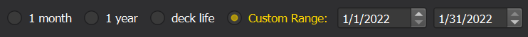
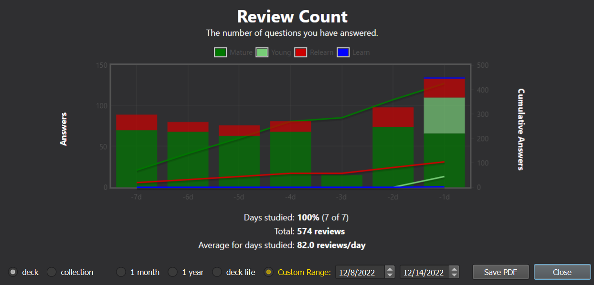

# Custom Stats Range

Custom Stats Range (CSR) is an Anki add-on that lets the user supply a custom date range for the Stats window. Enter any start & end date instead of being confined to the default "1 month," "1 year," and "deck life."

## Screenshots

## Installation

To install, see the add-on's page on [AnkiWeb](https://ankiweb.net/shared/info/84374528).

## Features

- Better fine-tuning over which statistics you want to see
- Compare your performance over time ("this week vs. last week", "this month vs. last month", etc.)
- Make ranges as large or as small as you like

## Compatibility

**Anki versions**: I have tested this on 2.1.49 and 2.1.54 (Qt5 and Qt6) on Windows. Earlier versions (2.1.x) will probably work, but have caution.

**Other add-ons**: This may break other add-ons that modify the Stats window. Anki does not provide an API, and the logic for the default options ("1 month," "3 month") has been baked deep into the source code. Thus, I've had to rip out and overwrite many of the functions that calculate and display statistics. If other add-ons are trying to patch those same functions, one of them will suffer. So far I have made this compatible with [Review Heatmap](https://ankiweb.net/shared/info/1771074083) and [True Retention](https://ankiweb.net/shared/info/613684242), but I haven't tested alongside many other add-ons.

## Notes

- **You must use the old Stats window for this add-on by shift-clicking the Stats button.** The new Stats window (added in 2.1.28) is written with a different framework which is much harder to modify as it requires complex & undocumented JavaScript injections.
- **The Forecast and Intervals graphs are hidden when CSR is on.** This is because they usually do not show any relevant information for the custom range.
